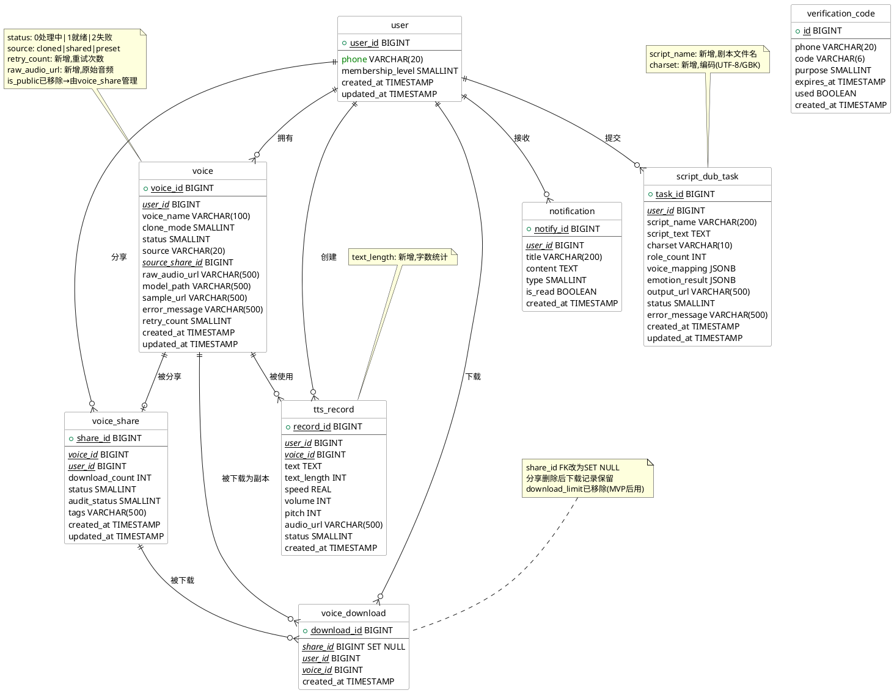

# 音色共享平台 — 数据库设计说明书

| 项目 | 内容 |
|------|------|
| **文档版本** | V2.0（需求覆盖验证版） |
| **数据库** | MySQL 8.0 |
| **字符集** | UTF-8 |
| **引擎** | InnoDB |
| **日期** | 2026-07-05 |
| **需求覆盖** | 39/39 REQ 全部支撑，详见需求-数据库映射表 |

---

## 0. 需求-数据库映射矩阵

### 模块一：语音克隆与TTS合成

| REQ | 需求名称 | 支撑表/字段 | 说明 |
|:---:|----------|-------------|------|
| REQ-001 | 手机号注册与登录 | `user(phone)` | 唯一索引保障手机号唯一 |
| REQ-002 | 音频上传 | `voice(raw_audio_url)` | 新增字段记录原始音频路径 |
| REQ-003 | 音频预处理 | 应用层逻辑 | 不涉及数据库 |
| REQ-004 | 即时克隆 | `voice(clone_mode=0)` | 模式区分 |
| REQ-005 | 深度克隆 | `voice(clone_mode=1)` | 模式区分 |
| REQ-006 | 克隆失败重试 | `voice(retry_count, error_message)` | 新增retry_count |
| REQ-007 | 音色管理 | `voice` + `voice_share` | 全部字段支撑 |
| REQ-008 | TTS文本合成 | `tts_record(text, voice_id)` | 字段支撑 |
| REQ-009 | TTS参数调节 | `tts_record(speed, volume, pitch)` | 字段支撑 |
| REQ-010 | 在线播放/下载 | `tts_record(audio_url)` | 字段支撑 |
| REQ-011 | 合成历史 | `tts_record(user_id)` | 索引支撑列表查询 |
| REQ-012 | 边界情况处理 | 应用层逻辑 | 不涉及数据库 |

### 模块二：剧本智能配音

| REQ | 需求名称 | 支撑表/字段 | 说明 |
|:---:|----------|-------------|------|
| REQ-021 | 剧本上传 | `script_dub_task(script_text, script_name)` | 新增文件名 |
| REQ-022 | 角色分割 | `script_dub_task(role_count, voice_mapping JSONB)` | JSON存储角色→音色映射 |
| REQ-023 | 情感分析 | `script_dub_task(emotion_result JSONB)` | JSON存储逐句情感结果 |
| REQ-024 | 情感→TTS参数 | `emotion_result` (隐式) | 应用层解析JSON后映射 |
| REQ-025 | 音色匹配 | `voice_mapping JSONB` | 记录匹配结果 |
| REQ-026 | MP3生成/下载 | `script_dub_task(output_url)` | 字段支撑 |
| REQ-027 | 结果修改调整 | `script_dub_task(status)` | 允许重新生成 |
| REQ-028 | 角色超限提示 | `script_dub_task(role_count)` | 字段支撑前端判断 |
| REQ-029 | 空语音库引导 | 应用层逻辑 | 查询voice表判断 |
| REQ-030 | 非剧本兜底 | 应用层逻辑 | 不涉及数据库 |

### 模块三：分享平台

| REQ | 需求名称 | 支撑表/字段 | 说明 |
|:---:|----------|-------------|------|
| REQ-031 | 音色分享 | `voice_share(voice_id, status=1)` | 分享记录 |
| REQ-032 | 取消分享 | `voice_share(status=0)` | 软删除 |
| REQ-033 | 浏览搜索 | `voice_share + voice(voice_name)` | pg_trgm索引支撑模糊搜索 |
| REQ-034 | 预览 | `voice(sample_url)` | 字段支撑 |
| REQ-035 | 下载到语音库 | `voice_download` + `voice(source=shared)` | 下载记录+音色副本 |
| REQ-036 | 下载音色用于TTS | `voice(source=shared)` | 用于TTS时与克隆音色无异 |
| REQ-037 | 下载音色用于配音 | `voice(source=shared)` | 同上 |
| REQ-038 | 配音历史 | `script_dub_task` | 已覆盖 |
| REQ-039 | GBK编码识别 | `script_dub_task(charset)` | 新增字段记录检测编码 |

---

## 1. ER图（PlantUML）



---

## 2. 变更说明（V1.0 → V2.0）

| # | 变更 | 表 | 原因 |
|:-:|------|----|------|
| 1 | ❌ 移除 `is_public` | voice | 冗余，分享状态由 `voice_share.status` 管理 |
| 2 | ➕ 新增 `raw_audio_url` | voice | REQ-002，记录上传原始音频路径 |
| 3 | ➕ 新增 `retry_count` | voice | REQ-006，跟踪克隆重试次数 |
| 4 | ➕ 新增 `text_length` | tts_record | REQ-008，记录合成字数用于统计/限流 |
| 5 | ➕ 新增 `script_name` | script_dub_task | REQ-021，记录剧本文件名 |
| 6 | ➕ 新增 `charset` | script_dub_task | REQ-039，记录检测到的文件编码 |
| 7 | 🔄 `voice_download.share_id` FK | voice_download | RESTRICT→**SET NULL**，分享删除后下载记录保留 |
| 8 | ❌ 移除 `download_limit` | voice_download | MVP暂不需要，后续版本可加 |
| 9 | ➕ 新增 pg_trgm 索引 | voice(voice_name) | REQ-033，支撑音色名称模糊搜索 |
| 10 | 🔄 `voice.status` 值域精简 | voice | 原3=已分享移除，分享由voice_share管理 |

---

## 3. DDL语句

```sql
-- ============================================================
-- 音色共享平台 — MySQL 8.0 DDL
-- 引擎: InnoDB  字符集: utf8mb4
-- ============================================================

-- ============================================================
-- 1. 用户表
-- ============================================================
CREATE TABLE `user` (
    user_id          BIGINT          AUTO_INCREMENT PRIMARY KEY,
    phone            VARCHAR(20)     NOT NULL,
    membership_level TINYINT         NOT NULL DEFAULT 0,
    created_at       DATETIME        NOT NULL DEFAULT CURRENT_TIMESTAMP,
    updated_at       DATETIME        NOT NULL DEFAULT CURRENT_TIMESTAMP ON UPDATE CURRENT_TIMESTAMP,
    UNIQUE INDEX idx_user_phone (phone),
    INDEX idx_user_created_at (created_at)
) ENGINE=InnoDB DEFAULT CHARSET=utf8mb4 COMMENT='用户表';

-- ============================================================
-- 2. 音色表
-- ============================================================
CREATE TABLE voice (
    voice_id         BIGINT          AUTO_INCREMENT PRIMARY KEY,
    user_id          BIGINT          NOT NULL,
    voice_name       VARCHAR(100)    NOT NULL,
    clone_mode       TINYINT         NOT NULL DEFAULT 0 COMMENT '0:即时克隆 1:深度克隆',
    status           TINYINT         NOT NULL DEFAULT 0 COMMENT '0:处理中 1:就绪 2:失败',
    source           VARCHAR(20)     NOT NULL DEFAULT 'cloned' COMMENT 'cloned:克隆 shared:下载 preset:预设',
    source_share_id  BIGINT          DEFAULT NULL,
    raw_audio_url    VARCHAR(500)    DEFAULT NULL,
    model_path       VARCHAR(500)    DEFAULT NULL,
    sample_url       VARCHAR(500)    DEFAULT NULL,
    error_message    VARCHAR(500)    DEFAULT NULL,
    retry_count      TINYINT         NOT NULL DEFAULT 0,
    created_at       DATETIME        NOT NULL DEFAULT CURRENT_TIMESTAMP,
    updated_at       DATETIME        NOT NULL DEFAULT CURRENT_TIMESTAMP ON UPDATE CURRENT_TIMESTAMP,
    INDEX idx_voice_user_id (user_id),
    INDEX idx_voice_status (status),
    INDEX idx_voice_source (source),
    INDEX idx_voice_created_at (created_at),
    FULLTEXT INDEX idx_voice_name_ft (voice_name)
) ENGINE=InnoDB DEFAULT CHARSET=utf8mb4 COMMENT='音色表';

-- ============================================================
-- 3. TTS合成记录表
-- ============================================================
CREATE TABLE tts_record (
    record_id        BIGINT          AUTO_INCREMENT PRIMARY KEY,
    user_id          BIGINT          NOT NULL,
    voice_id         BIGINT          NOT NULL,
    text             TEXT            NOT NULL,
    text_length      INT             NOT NULL DEFAULT 0 COMMENT '文本字数',
    speed            DECIMAL(3,1)    NOT NULL DEFAULT 1.0 COMMENT '语速 0.5-2.0',
    volume           INT             NOT NULL DEFAULT 80 COMMENT '音量 0-100',
    pitch            INT             NOT NULL DEFAULT 0 COMMENT '音调 -12~+12半音',
    audio_url        VARCHAR(500)    DEFAULT NULL,
    status           TINYINT         NOT NULL DEFAULT 0 COMMENT '0:处理中 1:成功 2:失败',
    created_at       DATETIME        NOT NULL DEFAULT CURRENT_TIMESTAMP,
    INDEX idx_tts_user_id (user_id),
    INDEX idx_tts_voice_id (voice_id),
    INDEX idx_tts_created_at (created_at)
) ENGINE=InnoDB DEFAULT CHARSET=utf8mb4 COMMENT='TTS合成记录表';

-- ============================================================
-- 4. 剧本配音任务表
-- ============================================================
CREATE TABLE script_dub_task (
    task_id          BIGINT          AUTO_INCREMENT PRIMARY KEY,
    user_id          BIGINT          NOT NULL,
    script_name      VARCHAR(200)    DEFAULT NULL COMMENT '剧本文件名',
    script_text      TEXT            NOT NULL,
    charset          VARCHAR(10)     DEFAULT NULL COMMENT '文件编码 UTF-8/GBK',
    role_count       INT             NOT NULL DEFAULT 0,
    voice_mapping    JSON            DEFAULT NULL COMMENT '角色→音色映射',
    emotion_result   JSON            DEFAULT NULL COMMENT '逐句情感分析结果',
    output_url       VARCHAR(500)    DEFAULT NULL,
    status           TINYINT         NOT NULL DEFAULT 0 COMMENT '0:处理中 1:成功 2:失败',
    error_message    VARCHAR(500)    DEFAULT NULL,
    created_at       DATETIME        NOT NULL DEFAULT CURRENT_TIMESTAMP,
    updated_at       DATETIME        NOT NULL DEFAULT CURRENT_TIMESTAMP ON UPDATE CURRENT_TIMESTAMP,
    INDEX idx_script_dub_user_id (user_id),
    INDEX idx_script_dub_status (status),
    INDEX idx_script_dub_created_at (created_at)
) ENGINE=InnoDB DEFAULT CHARSET=utf8mb4 COMMENT='剧本配音任务表';

-- ============================================================
-- 5. 音色分享表
-- ============================================================
CREATE TABLE voice_share (
    share_id         BIGINT          AUTO_INCREMENT PRIMARY KEY,
    voice_id         BIGINT          NOT NULL UNIQUE,
    user_id          BIGINT          NOT NULL,
    download_count   INT             NOT NULL DEFAULT 0,
    status           TINYINT         NOT NULL DEFAULT 1 COMMENT '0:已下架 1:已分享',
    audit_status     TINYINT         DEFAULT NULL COMMENT '审核状态(MVP预留)',
    tags             VARCHAR(500)    DEFAULT NULL,
    created_at       DATETIME        NOT NULL DEFAULT CURRENT_TIMESTAMP,
    updated_at       DATETIME        NOT NULL DEFAULT CURRENT_TIMESTAMP ON UPDATE CURRENT_TIMESTAMP,
    INDEX idx_voice_share_user_id (user_id),
    INDEX idx_voice_share_status (status),
    INDEX idx_voice_share_created_at (created_at),
    INDEX idx_voice_share_download_count (download_count DESC)
) ENGINE=InnoDB DEFAULT CHARSET=utf8mb4 COMMENT='音色分享表';

-- ============================================================
-- 6. 音色下载记录表
-- ============================================================
CREATE TABLE voice_download (
    download_id      BIGINT          AUTO_INCREMENT PRIMARY KEY,
    share_id         BIGINT          DEFAULT NULL COMMENT '分享者删除后可为NULL',
    user_id          BIGINT          NOT NULL,
    voice_id         BIGINT          NOT NULL,
    created_at       DATETIME        NOT NULL DEFAULT CURRENT_TIMESTAMP,
    INDEX idx_voice_download_share_id (share_id),
    INDEX idx_voice_download_user_id (user_id),
    INDEX idx_voice_download_voice_id (voice_id)
) ENGINE=InnoDB DEFAULT CHARSET=utf8mb4 COMMENT='音色下载记录表';

-- ============================================================
-- 7. 验证码表
-- ============================================================
CREATE TABLE verification_code (
    id               BIGINT          AUTO_INCREMENT PRIMARY KEY,
    phone            VARCHAR(20)     NOT NULL,
    code             VARCHAR(6)      NOT NULL,
    purpose          TINYINT         NOT NULL DEFAULT 0 COMMENT '0:注册 1:登录 2:其他',
    expires_at       DATETIME        NOT NULL,
    used             TINYINT(1)      NOT NULL DEFAULT 0,
    created_at       DATETIME        NOT NULL DEFAULT CURRENT_TIMESTAMP,
    INDEX idx_verification_code_phone (phone),
    INDEX idx_verification_code_expires (expires_at)
) ENGINE=InnoDB DEFAULT CHARSET=utf8mb4 COMMENT='短信验证码表';

-- ============================================================
-- 8. 通知表
-- ============================================================
CREATE TABLE notification (
    notify_id        BIGINT          AUTO_INCREMENT PRIMARY KEY,
    user_id          BIGINT          NOT NULL,
    title            VARCHAR(200)    NOT NULL,
    content          TEXT            DEFAULT NULL,
    type             TINYINT         NOT NULL DEFAULT 0 COMMENT '0:系统通知 1:克隆完成 2:配音完成',
    is_read          TINYINT(1)      NOT NULL DEFAULT 0,
    created_at       DATETIME        NOT NULL DEFAULT CURRENT_TIMESTAMP,
    INDEX idx_notification_user_id (user_id),
    INDEX idx_notification_is_read (is_read),
    INDEX idx_notification_created_at (created_at)
) ENGINE=InnoDB DEFAULT CHARSET=utf8mb4 COMMENT='用户通知表';

-- ============================================================
-- 外键约束（MySQL需建表后单独添加）
-- ============================================================
ALTER TABLE voice ADD CONSTRAINT fk_voice_user FOREIGN KEY (user_id) REFERENCES `user`(user_id);
ALTER TABLE tts_record ADD CONSTRAINT fk_tts_user FOREIGN KEY (user_id) REFERENCES `user`(user_id);
ALTER TABLE tts_record ADD CONSTRAINT fk_tts_voice FOREIGN KEY (voice_id) REFERENCES voice(voice_id);
ALTER TABLE script_dub_task ADD CONSTRAINT fk_script_user FOREIGN KEY (user_id) REFERENCES `user`(user_id);
ALTER TABLE voice_share ADD CONSTRAINT fk_share_voice FOREIGN KEY (voice_id) REFERENCES voice(voice_id) ON DELETE CASCADE;
ALTER TABLE voice_share ADD CONSTRAINT fk_share_user FOREIGN KEY (user_id) REFERENCES `user`(user_id);
ALTER TABLE voice_download ADD CONSTRAINT fk_download_share FOREIGN KEY (share_id) REFERENCES voice_share(share_id) ON DELETE SET NULL;
ALTER TABLE voice_download ADD CONSTRAINT fk_download_user FOREIGN KEY (user_id) REFERENCES `user`(user_id);
ALTER TABLE voice_download ADD CONSTRAINT fk_download_voice FOREIGN KEY (voice_id) REFERENCES voice(voice_id);
ALTER TABLE notification ADD CONSTRAINT fk_notify_user FOREIGN KEY (user_id) REFERENCES `user`(user_id) ON DELETE CASCADE;
```

---

## 4. 索引策略

| 表 | 索引 | 类型 | 说明 | 对应REQ |
|----|------|------|------|:-------:|
| user | idx_user_phone | UNIQUE BTREE | 手机号登录查询 | REQ-001 |
| user | idx_user_created_at | BTREE | 用户注册时间排序 | - |
| voice | idx_voice_user_id | BTREE | 用户音色列表查询 | REQ-007 |
| voice | idx_voice_status | BTREE | 状态筛选（就绪/失败） | REQ-007 |
| voice | idx_voice_source | BTREE | 来源筛选（克隆/下载） | REQ-036/037 |
| voice | idx_voice_name_ft | FULLTEXT | 音色名称模糊搜索 | REQ-033 |
| voice | idx_voice_created_at | BTREE | 音色创建时间排序 | - |
| tts_record | idx_tts_user_id | BTREE | 用户合成历史查询 | REQ-011 |
| tts_record | idx_tts_voice_id | BTREE | 音色使用统计 | - |
| tts_record | idx_tts_created_at | BTREE | 合成时间排序 | - |
| script_dub_task | idx_script_dub_user_id | BTREE | 用户配音历史查询 | REQ-038 |
| script_dub_task | idx_script_dub_status | BTREE | 状态筛选 | - |
| script_dub_task | idx_script_dub_created_at | BTREE | 任务时间排序 | - |
| voice_share | idx_voice_share_voice | UNIQUE BTREE | 音色与分享一对一 | REQ-031 |
| voice_share | idx_voice_share_user_id | BTREE | 分享者音色列表 | REQ-032 |
| voice_share | idx_voice_share_status | BTREE | 已上架音色筛选 | REQ-033 |
| voice_share | idx_voice_share_download_count | BTREE DESC | 热门排序 | REQ-033 |
| voice_download | idx_voice_download_share_id | BTREE | 分享下载统计 | - |
| voice_download | idx_voice_download_user_id | BTREE | 用户下载历史 | - |
| voice_download | idx_voice_download_voice_id | BTREE | 音色下载源追溯 | - |
| verification_code | idx_verification_code_phone | BTREE | 验证码查询 | REQ-001 |
| verification_code | idx_verification_code_expires | BTREE | 过期验证码清理 | - |
| notification | idx_notification_user_id | BTREE | 用户通知拉取 | - |
| notification | idx_notification_is_read | BTREE | 未读通知筛选 | - |
| notification | idx_notification_created_at | BTREE | 通知时间排序 | - |

---

## 5. 关键查询SQL示例

```sql
-- REQ-033：公共音色区搜索（名称关键词）
SELECT vs.share_id, v.voice_name, v.sample_url,
       vs.download_count, vs.created_at AS publish_time
FROM voice_share vs
JOIN voice v ON v.voice_id = vs.voice_id
WHERE vs.status = 1
   AND v.voice_name LIKE '%温柔%'
ORDER BY vs.download_count DESC, vs.created_at DESC
LIMIT 12 OFFSET 0;

-- REQ-011：用户TTS合成历史（含重新生成支持）
SELECT record_id, text, text_length, speed, volume, pitch,
       audio_url, status, created_at
FROM tts_record
WHERE user_id = 123
ORDER BY created_at DESC
LIMIT 20;

-- REQ-006：克隆失败的音色（供重试）
SELECT voice_id, voice_name, clone_mode, error_message, retry_count
FROM voice
WHERE user_id = 123 AND status = 2
  AND retry_count < 3;

-- REQ-031/032：用户已分享/已下架的音色
SELECT vs.share_id, v.voice_id, v.voice_name,
       vs.status AS share_status, vs.download_count
FROM voice_share vs
JOIN voice v ON v.voice_id = vs.voice_id
WHERE vs.user_id = 123
ORDER BY vs.created_at DESC;
```

---

## 6. 外键关系总结

| 父表 | 子表 | 外键字段 | 删除策略 | 说明 |
|------|------|----------|----------|------|
| user | voice | user_id | RESTRICT | 保护用户音色数据 |
| user | tts_record | user_id | RESTRICT | 保护合成历史 |
| user | script_dub_task | user_id | RESTRICT | 保护配音任务 |
| user | voice_share | user_id | RESTRICT | 保护分享记录 |
| user | voice_download | user_id | RESTRICT | 保护下载记录 |
| user | notification | user_id | CASCADE | 用户删除通知无意义 |
| voice | tts_record | voice_id | RESTRICT | 保护合成历史 |
| voice | voice_share | voice_id | CASCADE | 音色删除分享自动下架 |
| voice | voice_download | voice_id | RESTRICT | 保护下载记录 |
| voice_share | voice_download | share_id | **SET NULL** | 分享删除后下载记录保留（REQ-035） |

> 关键变更：`voice_download.share_id` 的删除策略从 `RESTRICT` 改为 `SET NULL`，满足PRD中"取消分享后，已下载该音色的用户仍可继续使用"的要求。
