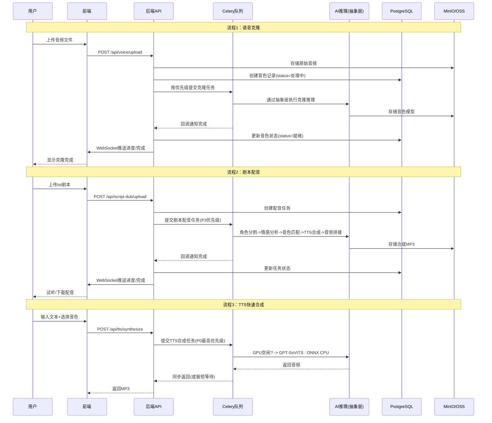
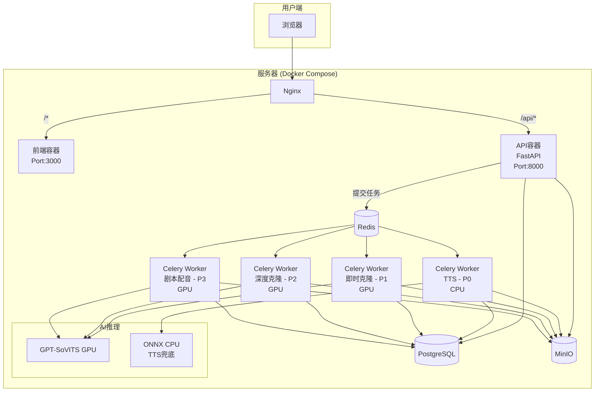

# 音色共享平台 — 系统架构设计说明书

| 项目 | 内容 |
|------|------|
| **文档版本** | V1.0（正式版） |
| **系统名称** | 音色共享平台 (Voice Sharing Platform) |
| **状态** | Approved |
| **日期** | 2026-07-05 |

---

## 1. 架构概览

### 1.1 分层架构

```
┌──────────────────────────────────────────────────────────────┐
│                      表现层 (Presentation)                      │
│                React + TypeScript + Vite                       │
│     用户管理页 | 语音克隆页 | TTS合成页 | 剧本配音页 | 音色市场     │
├──────────────────────────────────────────────────────────────┤
│                     API网关层 (API Gateway)                      │
│                Nginx反向代理 + JWT鉴权中间件                      │
├──────────────────────────────────────────────────────────────┤
│                       业务层 (Business)                         │
│    ┌──────────┐ ┌──────────┐ ┌──────────┐ ┌──────────┐       │
│    │ 用户模块  │ │ 音色管理  │ │ TTS合成  │ │ 剧本配音  │       │
│    └──────────┘ └──────────┘ └──────────┘ └──────────┘       │
│    ┌──────────┐ ┌──────────┐ ┌──────────────────────┐        │
│    │ 分享平台  │ │ 通知服务  │ │ 优先级任务队列(Celery) │        │
│    └──────────┘ └──────────┘ └──────────────────────┘        │
├──────────────────────────────────────────────────────────────┤
│                    AI推理抽象层 (Inference Abstraction)          │
│  ┌──────────────────────────────────────────────────────┐    │
│  │              InferenceEngine (Protocol)                │    │
│  │  统一接口：clone() / synthesize() / analyze_emotion()  │    │
│  ├──────────┬──────────┬──────────┬───────────────────┤    │
│  │GPT-SoVITS│CosyVoice │ONNX CPU  │   MockEngine       │    │
│  │(GPU主推)  │(GPU备选)  │(CPU兜底)  │   (开发测试)        │    │
│  └──────────┴──────────┴──────────┴───────────────────┘    │
│  ┌─────────────────┐ ┌──────────────────┐                   │
│  │ 剧本解析引擎     │ │ 音频处理服务      │                   │
│  │ (NLP+正则)      │ │ (FFmpeg)         │                   │
│  └─────────────────┘ └──────────────────┘                   │
├──────────────────────────────────────────────────────────────┤
│                       数据层 (Data)                            │
│    ┌──────────┐ ┌──────────┐ ┌──────────┐ ┌──────────┐      │
│    │PostgreSQL│ │  Redis   │ │ MinIO/OSS│ │ 本地缓存  │      │
│    │ 业务数据  │ │ 缓存/队列 │ │ 音频/模型 │ │          │      │
│    └──────────┘ └──────────┘ └──────────┘ └──────────┘      │
└──────────────────────────────────────────────────────────────┘
```

### 1.2 模块划分与职责

| 模块 | 职责 | 关键依赖 |
|------|------|----------|
| **用户模块** | 注册/登录、Token鉴权、用户信息管理 | PostgreSQL |
| **音色管理模块** | 音频上传、克隆任务管理、音色CRUD、试听 | PostgreSQL、MinIO、Celery |
| **AI推理抽象层** | 统一推理接口，支持多引擎切换 | GPT-SoVITS / CosyVoice / ONNX |
| **TTS合成模块** | 文本合成、参数调节、合成历史 | AI推理抽象层、PostgreSQL |
| **剧本配音模块** | 剧本上传、角色分割、情感分析、音色匹配、音频拼接 | AI推理抽象层、Celery |
| **情感分析引擎** | 台词情感分类（6类） | AI推理抽象层(BERT) |
| **分享平台模块** | 音色发布/下架、公共区浏览搜索、下载 | PostgreSQL、MinIO |
| **通知服务** | 克隆完成通知、站内通知 | Redis Pub/Sub |
| **优先级任务队列** | 按优先级调度异步任务 | Celery + Redis |

### 1.3 核心数据流



---

## 2. AI推理抽象层

### 2.1 接口定义

```python
from abc import ABC, abstractmethod

class InferenceEngine(ABC):
    """统一推理接口，所有模型实现此协议"""

    @abstractmethod
    def clone_voice(self, audio_path: str, mode: str) -> str: ...

    @abstractmethod
    def synthesize(self, text: str, model_path: str,
                   speed: float, volume: int, pitch: int) -> bytes: ...

    @abstractmethod
    def analyze_emotion(self, text: str) -> dict: ...

    @abstractmethod
    def supports_gpu(self) -> bool: ...

    @abstractmethod
    def estimated_time(self, task_type: str) -> int: ...
```

### 2.2 引擎注册与路由

```python
ENGINE_REGISTRY = {
    "gpt_sovits": GPTSoVITSEngine,    # GPU主推
    "cosy_voice": CosyVoiceEngine,    # GPU备选
    "onnx_cpu": ONNXCPUEgine,         # CPU兜底(仅TTS)
    "mock": MockEngine,               # 开发测试
}

def get_engine(task_type: str) -> InferenceEngine:
    if task_type == "deep_clone":
        return ENGINE_REGISTRY["gpt_sovits"]()
    elif task_type == "tts" and gpu_busy():
        return ENGINE_REGISTRY["onnx_cpu"]()
    return ENGINE_REGISTRY["gpt_sovits"]()
```

| 任务类型 | 首选引擎 | 备选引擎 |
|----------|----------|----------|
| 深度克隆 | GPT-SoVITS GPU | CosyVoice GPU |
| 即时克隆 | GPT-SoVITS GPU | - |
| TTS合成 | GPT-SoVITS GPU | ONNX CPU |
| 情感分析 | BERT CPU | - |

---

## 3. 优先级任务队列

### 3.1 队列配置

| 队列 | 优先级 | Worker数 | GPU需求 | 排队上限 | 超时时间 |
|:----:|:------:|:--------:|:-------:|:--------:|:--------:|
| TTS合成 | P0(最高) | 1 | 否(CPU) | 20 | 30s |
| 即时克隆 | P1 | 1 | 是 | 5 | 5min |
| 深度克隆 | P2 | 1 | 是 | 3 | 30min |
| 剧本配音 | P3(最低) | 1 | 是 | 3 | 5min |

### 3.2 前端排队展示

```json
{
    "task_id": "abc123",
    "position": 2,
    "estimated_wait_seconds": 180,
    "queue_ahead": ["task_prev_1"],
    "status": "queued"
}
```

---

## 4. 模块接口隔离设计

```python
class VoiceCloningService(ABC):
    @abstractmethod
    def create_clone_task(self, user_id: int, audio: bytes, mode: str) -> int: ...
    @abstractmethod
    def get_task_status(self, task_id: int) -> dict: ...

class TtsService(ABC):
    @abstractmethod
    def synthesize(self, user_id: int, text: str, voice_id: int,
                   speed: float, volume: int, pitch: int) -> int: ...
    @abstractmethod
    def get_history(self, user_id: int, page: int) -> list: ...

class ScriptDubService(ABC):
    @abstractmethod
    def create_dub_task(self, user_id: int, script: str) -> int: ...
    @abstractmethod
    def get_task_result(self, task_id: int) -> dict: ...

class SharePlatformService(ABC):
    @abstractmethod
    def share_voice(self, user_id: int, voice_id: int) -> bool: ...
    @abstractmethod
    def search_public_voices(self, keyword: str, page: int) -> list: ...
    @abstractmethod
    def download_voice(self, user_id: int, share_id: int) -> int: ...
```

---

## 5. 部署架构



**预算估算**：

| 资源 | 规格 | 月成本 |
|------|------|:------:|
| 应用服务器 | 4C8G | ¥500-800 |
| GPU实例 | RTX 4090 (按需) | ¥2000-3000 |
| 对象存储 | MinIO 500GB | ¥0 |
| 合计 | | ¥2500-3900/月 |

---

## 6. 技术选型总结

| 分层 | 技术 | 版本 | 说明 |
|------|------|:----:|------|
| 前端 | React + TypeScript + Vite | 18.x / 5.x | PRD指定，响应式设计 |
| 后端 | FastAPI + Uvicorn | 0.110.x | Python异步框架 |
| 数据库 | PostgreSQL | 15 | 主业务数据库 |
| 缓存/队列 | Redis | 7 | 缓存+Celery Broker |
| 对象存储 | MinIO | latest | 音频/模型文件 |
| AI语音 | GPT-SoVITS | 0.3 | 主推克隆引擎 |
| AI备选 | CosyVoice | latest | 备选克隆引擎 |
| CPU兜底 | ONNX Runtime | 1.16 | TTS合成CPU推理 |
| 情感分析 | BERT (bert-base-chinese) | - | 6分类情感 |
| 异步任务 | Celery | 5.3 | 优先级任务队列 |
| 音频处理 | FFmpeg | 6.x | 格式转换/拼接 |
| 部署编排 | Docker Compose | 3.8 | 单机容器编排 |
| 监控 | Prometheus + Grafana | latest | GPU/队列/API监控 |

---

## 7. 演进路线图

| 阶段 | 时间 | 目标 | 架构 |
|:----:|:----:|:----|:----:|
| **V1 MVP** | 1-8周 | 验证核心价值 | 单体 + 单GPU |
| **V2 优化** | 9-12周 | ONNX+优先级队列+监控 | 单体 + CPU兜底 |
| **V3 拆分** | 13-20周 | AI推理独立服务 | AI独立微服务 |
| **V4 生态** | 21周+ | 音色交易+多语言 | 完整微服务 |

---

## 8. 风险评估

| 风险 | 等级 | 应对策略 |
|------|:----:|----------|
| GPT-SoVITS克隆效果不稳定 | 🔴 | 多模型benchmark + 抽象层切换 |
| GPU资源成本 | 🟡 | CPU ONNX兜底 + 单GPU串行 |
| AI推理响应时间超预期 | 🟡 | 全异步 + WebSocket进度 |
| 单体后期拆分成本 | 🟡 | 模块接口隔离 + 绞杀者模式 |
| 模型许可证变更 | 🟢 | 推理接口抽象 + 多模型注册 |
| 短信服务商稳定性 | 🟡 | 主备双通道配置 |

**架构评审总分：87/100**（优化后）
